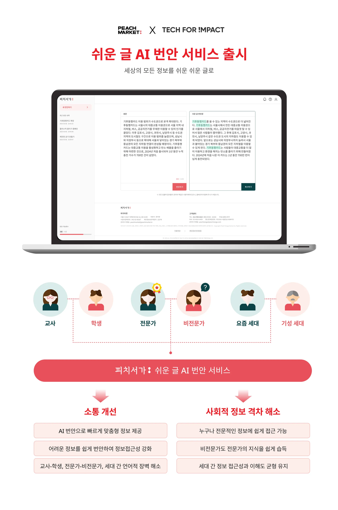

> Available at: [official website](https://ai.peachseoga.com/)

As part of a project aimed at reducing social information inequality, I worked as an **AI Engineer** to build a system that adapts complex texts into simplified, easy-to-understand language for slow learners—including individuals with developmental disabilities.

This work supports more equitable access to information, especially for those who struggle with traditional communication due to cognitive, educational, or social factors.

##### 🔧 Contributions

* **Designed an evaluation framework** to define and measure “text simplicity” for LLM-based text simplification, incorporating both linguistic and user-centered metrics.
* **Collaborated closely with high-level members** at **Peachmarket**, a social impact startup, to co-develop a domain-specific dataset. This involved curating real-world texts and crafting prompt strategies to guide LLMs toward effective simplification.

The final system aims to serve as a practical tool for educators, special education professionals, and content editors, helping bridge the communication gap between general and slow learners through personalized, AI-assisted text adaptation.

